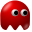
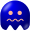

= Given a empty board with three crate to spawn and after 13 tics game board will look like

:0: 
:1: 
:2: 
:3: 
:4: 
:5: 
:6: 

[.myTable]
|===
| {1}| {0}
| {1}| {1}
|===
[.myTable]
|===
| {0}| {0}| {0}| {0}| {0}| {0}
| {0}| {0}| {0}| {0}| {0}| {0}
| {0}| {0}| {0}| {0}| {0}| {0}
| {0}| {0}| {0}| {0}| {0}| {0}
| {0}| {0}| {0}| {0}| {0}| {0}
| {0}| {0}| {0}| {0}| {0}| {0}
| {0}| {0}| {0}| {0}| {0}| {0}
| {0}| {0}| {0}| {0}| {0}| {0}
| {0}| {0}| {0}| {0}| {0}| {0}
| {0}| {0}| {0}| {0}| {0}| {0}
| {0}| {0}| {0}| {0}| {0}| {0}
| {0}| {0}| {1}| {0}| {0}| {0}
| {0}| {0}| {1}| {1}| {0}| {0}
|===

++++

++++

